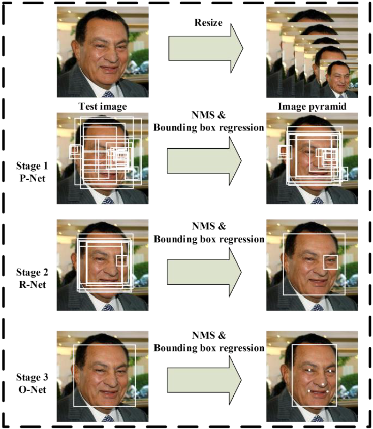
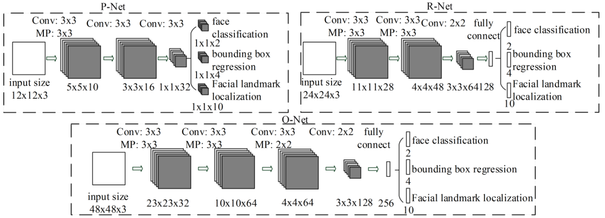

#    MTCNN - 學習筆記

**簡要說明 :**

此篇[論文](https://kpzhang93.github.io/MTCNN_face_detection_alignment/index.html)發表於2016年，摘要中簡要提出當前人臉偵測與矯正所遇到的困境，例如 : 複雜環境、人臉姿態、光照、occlusions(不確定怎麼翻比較合適)。作者提出一個利用固有的相關關係來提升效能的深度學習框架(Deep Cascaded Multi-task framework)，此框架採用一個三階段CNN的聯集架構用於預測人臉與五官在圖像中的位置，並且是一個從粗到細的方法。除此之外，作者還提出一項新的online hard sample mining策略，可以在不需手動採養選取的情況下自動提高效能。

*補充與理解* :

針對人臉偵測的應用場景來說，我個人認為作者主要把重心放在場景相對複雜的實時 動態人臉偵測。我目前的研究項目與應用場景(門禁系統)中其實是相對簡單，傳統人臉檢測方式(Haar, LBP, dlib)在CPU等級是可以符合大多數的應用，但由於我是用於一般家庭的門禁系統，因此對於在檢測方面魯棒性要求要高，才能滿足用戶體驗，傳統方法嚴重受限於場景。

從摘要中可以得知，作者提出幾個要點 :

1. 利用人臉特徵與五官的關聯訊息得到效能與準確度提升。
2. 採用三階段輕量的網路聯集架構，每個階段是從粗到細的過程。
3. 提出新的online hard sample mining。

## 網路 架構詳解

MTCNN的CNN網路結構是參考[A Convolutional Neural Network Cascade for Face Detection[1]](http://users.eecs.northwestern.edu/~xsh835/assets/cvpr2015_cascnn.pdf)，基於此篇的多重卷積神經網路人臉偵測，MTCNN作者針對上述論文的方法提出幾個缺點 :

1. 有些filter缺乏權重的多樣性，可能會限制生產判別的描述。我的理解是filter權重不夠多樣造成產生的判斷不夠準確。
2. 與其他多類別目標偵測與分類來說，人臉偵測是一項具挑戰性的二分類任務，因此需要較少數的filter，但需要區別性較較多的filter。

由於上述兩項缺點，MTCNN的作者做了針對性的調整，**減少filter的數量，且用3x3的filter替換5x5的filter以增加深度而減少計算量，得到更好的效能**。與參考的網路相比耗時少，參考下面列表。

| Group  | CNN       | 300 Times Forward(s) | Accuracy(%) |
| ------ | --------- | -------------------- | ----------- |
| Group1 | 12-Net[1] | 0.038                | 94.4        |
| Group1 | P-Net     | 0.031                | 94.6        |
| Group2 | 24-Net[1] | 0.738                | 95.1        |
| Group2 | R-Net     | 0.458                | 95.4        |
| Group3 | 48-Net[1] | 3.577                | 93.2        |
| Group3 | O-Net     | 1.347                | 95.4        |

主要分為三個階段與網路，Proposal Network(P-Net)、Refine Network(R-Net)、Output Network(O-Net)，其各自的流程為上圖。看似三層網路可能是相連且參數量較多，但實際上各層網路中間還需要經過轉換處理，大致上理解是用bounding box regression vectors去矯正候選框與用NMS(Non-maximum suppresion)融合高重合候選框，其詳細架構為下圖。下列是三層CNNs的目的與說明 : 

1. **Proposal Network(P-Net)** : 是一個全卷積網路(fully convolutional neural network)，目的是產生候選框與bounding box regression vectors，且方法與[Multi-view Face Detection Using Depp Convolutional Neural Network[2]](https://arxiv.org/pdf/1502.02766.pdf)相似。
2. **Refine Network(R-Net)** : 其輸入為P-Net輸出的候選框，目的是剔除錯誤(沒有人臉)的候選框。
3. **Output Network(O-Net)** : 與R-Net相似，但主要目的是更清楚描述人臉，會將R-Net輸出的候選框當作輸入，且一張人臉會產生一個最後的人臉框座標與五個人臉要點的位置。

    

## 訓練任務與損失函數詳解

此網路的目的是實時地得到準確的人臉位置與五個人臉關鍵點。主要利用下述三項任務去訓練偵測器，有無人臉分類器、bounding box regression與人臉關鍵點定位(facial landmark localization)。其中針對不同的任務與分類器，所需要的損失函數也相對不同。以下將針對訓練任務與MTCNN作者所提出的損失函數進行說明與分析 :

1. **人臉分類** : 

   學習目標被表述為一個二分類問題，任意樣本為例，作者使用交叉熵損失(cross-entropy loss) :

   

   其中是由網路產生的機率，用來表示一個樣本是一張人臉的機率。表示ground-truth 標籤。

   *理解與疑問* : 

   針對分類問題，理論上希望錯誤率越低越好，但通常不會直接使用錯誤率作為損失函數，原因是單看錯誤率無法比較模型之間的差異，因為可能出現相同錯誤率但不同準確度的情形。造成在進行模型訓練時難以得到較好的學習方向，當用錯誤率判別時，無法得知目前模型的錯誤是多或是少，因此也不知道最佳模型的要往哪個方向與更新多少。

   cross-entropy loss function本身在loss function的兩大類(regression/classification)中屬於分類，且主要用於二分類問題，其中的entropy是**接收的所有資訊所包含訊息的平均量**，用來察看資料的混亂度與不確定性。cross-entropy的含意是真實類別的判斷正確機率，可以得知當cross-entropy越小模型的效果越好([詳細說明1](https://medium.com/@chih.sheng.huang821/%E6%A9%9F%E5%99%A8-%E6%B7%B1%E5%BA%A6%E5%AD%B8%E7%BF%92-%E5%9F%BA%E7%A4%8E%E4%BB%8B%E7%B4%B9-%E6%90%8D%E5%A4%B1%E5%87%BD%E6%95%B8-loss-function-2dcac5ebb6cb)、[詳細說明2](https://medium.com/@chungyizhen/cross-entropy%E7%9A%84%E7%9B%B4%E8%A7%80%E7%90%86%E8%A7%A3-82e525e3780c))。

   近年在CNNs中較常見的Softmax loss也是基於cross-entropy的變形，因此我有個疑問為何作者只單純使用cross-entropy而非Sigmoid或是Softmax + cross-entropy。

2. **Bounding box regression** : 

   作者預測任意候選框與其最近的ground truth之間的位移，學習目標被表述為一個回歸問題，且對任意樣本使用歐式損失(Euclidean loss) :

   

   其中回歸目標是從網路獲取的，且是ground-truth的座標。總共有四個座標，包含左上、寬、高等等，且其限制用數學式表示為，的意思是實數。

   *理解與疑問* : 

   代表的是第二正規化(范式)，單純將上述的公式轉換後發現與L2公式相同，但歐式損失定義為，可以發現與上述的公式比多了，所以在這裡我有一些困惑。除此之外，還有在此用歐式損失的涵義為何目前我也沒理解。

3. **人臉關鍵點定位 (facial landmark localization)** : 

   與bounding box regression任務相似，人臉關鍵點偵測(facial landmark detection)被表述為一個回歸問題，且作者最小化了歐式損失(Euclidean loss) : 

   

   其中是從網路獲取的人臉關鍵點座標，則是ground-truth座標。總共有五個人臉關鍵點，包含雙眼、鼻子與左右嘴角，且。

   *理解與疑問* : 

   由於與bounding box regression運作相似，因此也是使用了歐式損失，作者在文中說針對此部分的損失函數做了最小化。我有兩個疑問 :

   1. 歐式損失在此的作用與涵義。
   2. 如何做最小化與目的。

4. **Multi-source training** : 

   將不同任務分配到每個CNNs中，造就在學習的過程中需要不同類型的訓練圖片，例如 : 包含人臉的、不包含人臉的與部分矯正(對齊)的人臉圖片。在某些情況下，上述的損失函數可能不會全部都用到，例如 : 圖片背景區域樣本只計算，另外兩個損失函數的數值被設定為0。此任務可以直接用一個sample type indicator實現，所有的學習目標可以被表示為 : 

   

   其中是訓練樣本的數量，表示任務的重要性。作者為了得到精度更高的人臉關鍵點定位，在P-Net與R-Net中用的參數為，O-Net為。則是**此**樣本類型指示器 (is the sample type indicator)，在此條件下用隨機梯度下降(stochastic gradient descent)訓練CNNs是很自然的。

   *理解與疑問* : 

   作者在此將上述三項損失函數統整到一項數學式中，但針對multi-source training的概念有幾項不了解的地方 : 

   1. 什麼是sample type indicator，還有其作用是什麼?
   2. 如何把前三項損失函數統整成一項數學式?
   3. 為什麼在這樣的條件下使用隨機梯度下降是很自然的? 是否有反向傳播?

5. **Online Hard sample mining** : 

   與最初的分類器在被訓練後進行traditional hard sample mining不同，人臉分類任務中採用online hard sample mining用來適應訓練過程。

   在每個mini-batch的前向傳播(forward propagation)階段中，依照已經計算完成的損失函數數值排序全部樣本，並選擇前70%作為重樣本(hard samples)。在反向傳播(backward propagation / backpropagation)階段只從重樣本中計算梯度(gradient)，這代表**忽略簡單的樣本，換句話說，就是忽略在訓練中對強化此檢測器幫助較少的樣本**。

   *理解與疑問* : 

   我理解在此論文中提出的人臉檢測方法中使用online hard sample mining取代traditional hard sample mining，目的是忽略training中對提升檢測器精準度幫助較少的樣本，如此一來，既可以維持準確度亦可以提升速度。

## 優化方向

我認為優化不需要只考慮網路本身，可以分成幾個方向來剖析問題 :

1.  input : 
   1.  原圖resize : 對input做下採樣。說白一點，有點像是slide window在掃描圖片時，圖片縮小造成需要掃描的面積減掃，導致運行速度加快，準確度下降。如何找到平衡點需要programmer自行調適。
   2.  face minimum size : 放大掃描人臉的最小框。當一張圖片上用slide window(face window)掃描原圖生成候選框時，框體面積增大而掃描面積固定導致速度會提升，但人臉小於基本框體則無法偵測出來。
2.  網路 : 目前針對網路的部分只有一些想法，主要是此篇論文為2016年提出，在之後提出的方法與改念都可以用在優化的部分。目前可以分稱幾個部分 : 捲積、網路架構、池化、損失函數。
3.  output : output的部分其實有牽涉到網路結構，雖然是改進網路結構，但主要的思想來自我認為不需要O-Net輸出的facial landmark，而facial landmark確實對人臉偵測有所幫助，因此想切除O-Net只做P-Net與R-Net。目前的結果不甚理想，不知道原因為何，速度在face minimum size = 20下只提升1~2fps且準確度略有下降。